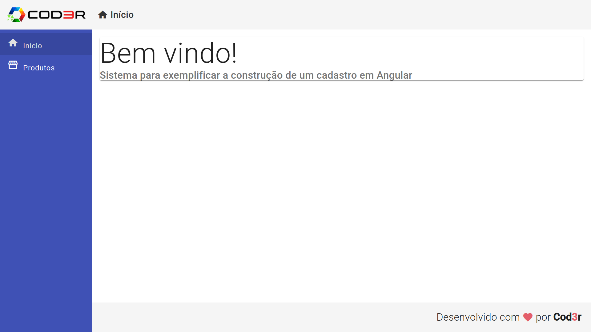
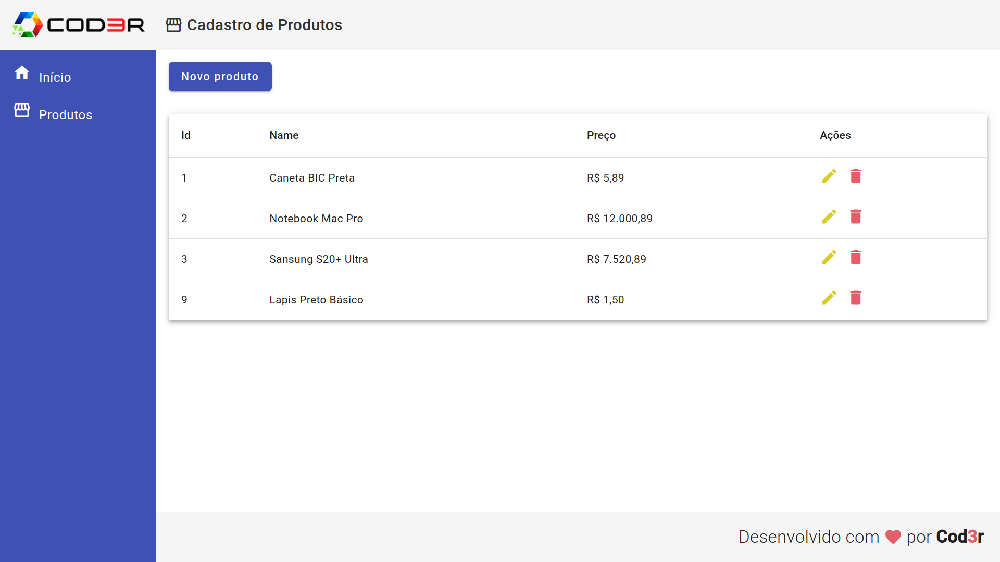

# [Angular](https://angular.io/) Crud

[Partial Live preview](https://gabriel-del.github.io/CRUD-Angular/) without [json-server](https://github.com/typicode/json-server)

# Run

```bash
pnpm
pnpm serve #json-server
pnpm start #angular
```

# Credits

[Angular 9 - Cod3r](https://www.cod3r.com.br/courses/angular-9-essencial)

<!-- https://github.com/angular-schule/angular-cli-ghpages -->

# Preview

<!--  -->




